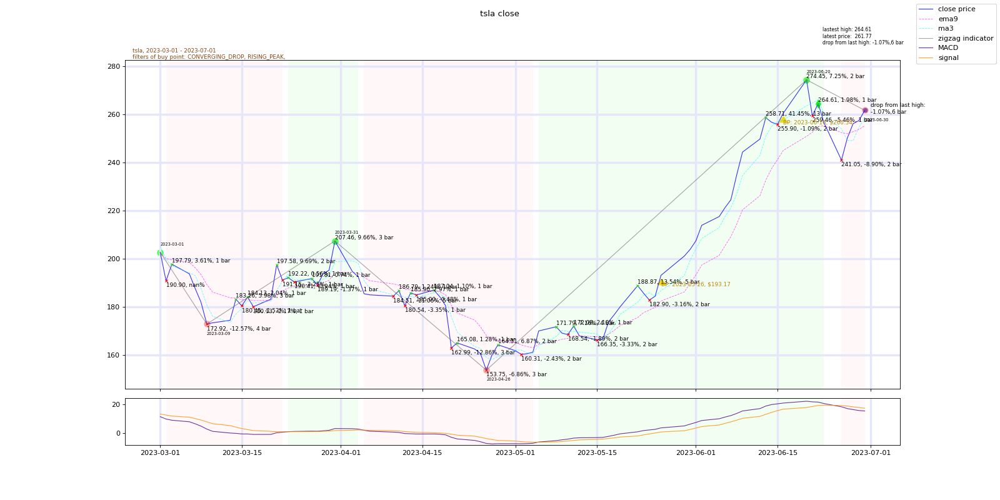

<!-- vscode-markdown-toc -->
* 1. [Goal](#Goal)
* 2. [Buy point filters](#Buypointfilters)
	* 2.1. [How to add buy point filter](#Howtoaddbuypointfilter)
* 3. [Sell Strategy](#SellStrategy)
* 4. [How to use](#Howtouse)
	* 4.1. [Run `stock_analyser.py`](#Runstock_analyser.py)
		* 4.1.1. [Description](#Description)
		* 4.1.2. [Run `stock_analyser.py` in command line](#Runstock_analyser.pyincommandline)
		* 4.1.3. [Outputs](#Outputs)
	* 4.2. [Run `backtest.py`](#Runbacktest.py)
		* 4.2.1. [Description](#Description-1)
		* 4.2.2. [Run `backtest.py` in command line](#Runbacktest.pyincommandline)
		* 4.2.3. [Run by config (.json) in command line](#Runbyconfig.jsonincommandline)
		* 4.2.4. [Parameter parsing logic when run in command line](#Parameterparsinglogicwhenrunincommandline)
		* 4.2.5. [Outputs](#Outputs-1)
	* 4.3. [Import class](#Importclass)
* 5. [Details of `StockAnalyser.stock_data`](#DetailsofStockAnalyser.stock_data)
	* 5.1. [columns in `StockAnalyser.stock_data`:](#columnsinStockAnalyser.stock_data:)
* 6. [Details of `StockAccount.txn`](#DetailsofStockAccount.txn)
	* 6.1. [columns in  `StockAccount.txn`:](#columnsinStockAccount.txn:)
* 7. [Buy Sell Logic](#BuySellLogic)
* 8. [Log](#Log)
* 9. [Advanced Settings](#AdvancedSettings)
	* 9.1. [Source of Extrema:](#SourceofExtrema:)
	* 9.2. [Source of uptrend](#Sourceofuptrend)
	* 9.3. [Parameter of StockAnalyser.default_analyser](#ParameterofStockAnalyser.default_analyser)
* 10. [Example Result](#ExampleResult)
	* 10.1. [example plot](#exampleplot)
* 11. [Unit Test](#UnitTest)
	* 11.1. [Test script](#Testscript)
		* 11.1.1. [Expected Output](#ExpectedOutput)
	* 11.2. [Pytest](#Pytest)
		* 11.2.1. [Expected Output](#ExpectedOutput-1)
* 12. [Techniques Studied](#TechniquesStudied)
	* 12.1. [Stock price smoothing technique](#Stockpricesmoothingtechnique)
* 13. [Bug to be solved:](#Bugtobesolved:)
* 14. [2021 Version](#Version)
* 15. [Peaks and Bottoms](#PeaksandBottoms)
	* 15.1. [Example](#Example)
	* 15.2. [Limitations Using Blackman Window](#LimitationsUsingBlackmanWindow)
	* 15.3. [Limitations Using Polynomial Regression](#LimitationsUsingPolynomialRegression)
* 16. [Trend](#Trend)
	* 16.1. [Example](#Example-1)
	* 16.2. [Limitations](#Limitations)
* 17. [Smoothing the Data ("Noise" Reduction)](#SmoothingtheDataNoiseReduction)
* 18. [Linear Regression](#LinearRegression)

<!-- vscode-markdown-toc-config
	numbering=true
	autoSave=true
	/vscode-markdown-toc-config -->
<!-- /vscode-markdown-toc --># Stock

<a name='Version'></a>2023 Version


main class: 

`StockAnalyser` in app/stock_analyser.py

`BackTest` in app/back_test.py

`StockAccount` in app/back_test.py

# Todo  

- maximum draw down
- maximum market value
- Bug to be fixed regarding [inaccuracy in EMA in early period](#Bugtobesolved:)

##  1. <a name='Goal'></a>Goal

1. to draw bowls on historical stock price in different time frame

2. find break point (buy point)

3. set up sell strategy

4. conduct back test and calculate revenue

##  2. <a name='Buypointfilters'></a>Buy point filters

`BuyptFilter` in app/stock_analyser.py

| filter | description |
| ------ | ------ |
| IN_UPTREND |  - set all points in up trend as buy points<br><br> - up trend is defined by specified column name in stock_data, with value >0 indicate uptrend, < 0 indicate downtrend,<br><br> - default is slope of MACD signal line if column of trend source not specified <br><br> - this filter has no effect if either CONVERGING_DROP or RISING_PEAK is used, since  CONVERGING_DROP and  RISING_PEAK intrinsically only looks for bottoms in uptrend  |
|   CONVERGING_DROP     |   For all bottoms during uptrend:<br><br>if (peak-to-bottom drop) <  (previous peak-to-bottom drop)<br><br>the point (rise above previous peak) or (reach next peak), which ever earlier, is defined as break point   |
| RISING_PEAK  | For all bottoms during uptrend:<br><br>if rise above previous peak before next peak, <br><br> the point rise above previous peak is defined as break point |
|MA_SHORT_ABOVE_LONG |   all points for corresponding ma in "ma short" > "ma long" is set as buy points <br><br>e.g. ma short=[3, 20]<br> ma long = [9, 50]<br> all points where ma3> ma9 and ma20>ma50 are set as buy points|

###  2.1. <a name='Howtoaddbuypointfilter'></a>How to add buy point filter

- refer to [this issue](https://gitlab.com/asiabots/edward/stock-peak-bottom/-/issues/4) or  commit [b9809e5a](https://gitlab.com/asiabots/edward/stock-peak-bottom/-/commit/b9809e5a2879a3b4268f109e409fce6c956f3813)

##  3. <a name='SellStrategy'></a>Sell Strategy
`SellStrategy` in app/back_test.py
| Strategy | description |
| ------ | ------ |
| DEFAULT| currently set as = TRAILING_STOP|
|   TRAILING_STOP     |    Trailing Stop-loss (sell whenever drop n% from high point after buy)    |
|    HOLD_TIL_END    |  Hold until last day       |
| PROFIT_TARGET|  sell when profit target is reached|
| FIXED_STOP_LOSS| sell when drop n% from buy price|
|    TRAILING_AND_FIXED_SL | sell when at least one of trailing Stop-loss or fixed stop loss condition met|
| TRAIL_FIX_SL_AND_PROFTARGET|sell when at least one of trailing Stop-loss, fixed stop loss or profit target met|
|MIX | not defined yet (to be used in future) |


##  4. <a name='Howtouse'></a>How to use

###  4.1. <a name='Runstock_analyser.py'></a>Run `stock_analyser.py`
####  4.1.1. <a name='Description'></a>Description

 `stock_analyser.py` analyse a stock over a period and produce analysis information like peak, bottom points, up / down trend, zigzag indicator, MACD etc.

####  4.1.2. <a name='Runstock_analyser.pyincommandline'></a>Run `stock_analyser.py` in command line

##### Arguments

arguments of running `stock_analyser.py` in command line

|argument| description|example|
|-----|-----|-----|
|`-t` `--ticker` | stock ticker| PDD
|`-s` `--start` | start date| 2023-01-01|
| `-e` `--end` | end date|2023-08-01|
| `-f` `stocklist_file`| stock list file (.txt)|./stock_list.txt<br>([exmaple file](https://gitlab.com/asiabots/edward/stock-peak-bottom/-/blob/enhance-data-presentation/app/configs/hot25stocks.txt?ref_type=heads))|
|`-v` `--csv_dir` | file directory of stock data and roll result csv to save in|../result|
| `-g` `--graph_dir` | file directory of graph to save in|../graph_dir|
|`-o` `--showopt` | graph show option |"save" - save to graph_dir<br>"show" - show by plot.show()<br>"no" - don't plot graph   |

##### Example

go to app/stock_analyser.py 

example commands

- analyse one stock

```
python stock_analyser.py -t=PDD -s=2022-08-01 -e=2023-08-01 -g=../graph_dir -v=../csv_dir
```

- analyse list of stock from txt file

```
python stock_analyser.py -f=./configs/2stocks.txt -s=2022-08-01 -e=2023-08-01 -g=../graph_dir -v=../csv_dir
```

####  4.1.3. <a name='Outputs'></a>Outputs

1. print analysis data in .csv file 
     - default file name and directory: `../../result/stock_data_{stock ticker}_{start date}_{end date}.csv`
     - [click here to see details of all columns in stock data table](#columnsinStockAnalyser.stock_data:)
     - [click here for example file](https://gitlab.com/asiabots/edward/stock-peak-bottom/-/blob/enhance-data-presentation/example/stock_data_tsla_2022-08-01_2023-08-25_example.csv?ref_type=heads)
2. produce analysis graph in .png file
    - default file name and directory: `../../result/{stock ticker}_{start date}_{end date}.png`
    - [click here for example graph](https://gitlab.com/asiabots/edward/stock-peak-bottom/-/blob/enhance-data-presentation/example/tsla_2022-08-01_2023-08-25_bp_by_peak_bottom.png?ref_type=heads)
3. print analysis data and logging  in ./log/*.log 


###  4.2. <a name='Runbacktest.py'></a>Run `backtest.py`

####  4.2.1. <a name='Description-1'></a>Description

`backtest.py` obtain analysis data from `stock_analyser.py`, then conduct back test to simulate trading a stock. 

In the back test, user can specify which stock to trade, capital to put in, buy and sell strategy etc., and get a trading simulation in the form of a transaction table saved in `StockAccount.txn`.

####  4.2.2. <a name='Runbacktest.pyincommandline'></a>Run `backtest.py` in command line

##### Arguments

|argument| description|example|
|-----|-----|-----|
|`-t` `--ticker` | stock ticker| PDD
|`-s` `--start` | start date| 2023-01-01|
| `-e` `--end` | end date|2023-08-01|
| `-c` `--capital` | capital| 10000|
| `-f` `--stocklist_file`| stock list file (.txt)|./stock_list.txt|
| `-j` `--configfile`| config file (.json)|./config.json|
|`-v` `--csv_dir` | file directory of stock data and roll result csv to save in|../result|
| `-g` `--graph_dir` | file directory of graph to save in|../graph_dir|
|`-o` `--showopt` | graph show option |"save" - save to graph_dir<br>"show" - show by plot.show()<br>"no" - don't plot graph   |

##### Example

go to app/backtest.py

- run pdd, 1 year, with captial=$10000, no need to plot graph

```
python backtest.py -t=pdd -s=2022-08-01 -e=2023-08-16 -c=10000 -o=no -v=../back_test_result
```

- run  list of stock from txt file, 1 year, with captial=$10000, save graph

```
python backtest.py -f=./configs/2stocks.txt -s=2022-08-01 -e=2023-08-16 -c=10000 -o=save -v=../back_test_result -g=../graph_dir
```
####  4.2.3. <a name='Runbyconfig.jsonincommandline'></a>Run by config (.json) in command line 

##### Description

- pass argument required by backtest.py by a json config file

##### Table of parameters in JSON config file


| param | description |  data type|example| required|
| ------ | ------ |------ |------ |------ |
|ticker|     stock ticker   |  str<br>/<br>list of str |"PDD"<br>["PDD", "TSLA", "VRTX"] |yes|
|  start      |    test start date<br> (yyyy-mm-dd)    |  str  | "2023-01-01" |yes|
|  end      |    test end date <br>(yyyy-mm-dd)   |  str | "2023-08-01" |yes|
|  capital      |    initial capital for backtest   |  int / float | 10000 |no<br>- if not set, set to default as 10000|
|    ma short    |    short ma to use in MA_SHORT_ABOVE_LONG filter    |   list of int |[3]<br>[3,20]|no|
|   ma long     |   long ma to use in MA_SHORT_ABOVE_LONG filter      |    list of int |[9]<br>[9,50]<br>e.g. ma short=[3, 20]<br> ma long = [9, 50]<br> ==>all points where ma3> ma9 and ma20>ma50 will be set as buy points |no|
|   plot ma     |     extra ma to plot on graph, but will not affect buy point     |  list of str<br>|["ma3", "ema9"]  |no|
|   buy point filters     |    filters to find buy point, buy point are set if all filter met    | list of str|  "IN_UPTREND"<br> "CONVERGING_DROP"<br> "RISING_PEAK"<br>"MA_SHORT_ABOVE_LONG"  |no <br> - if no filter set, no buy points will be found|
|buy strategy | buy strategy, currently only support follow buy point filter |str | "FOLLOW_BUYPT_FILTER"<br>(the only option currently)  |no|
| sell strategy| sell strategy |str| "DEFAULT"(currently set as trailing stop)<br>"TRAILING_STOP"<br>"HOLD_TIL_END"<br>"PROFIT_TARGET"<br>"FIXED_STOP_LOSS"<br>"TRAILING_AND_FIXED_SL"<br>"TRAIL_FIX_SL_AND_PROFTARGET" |no <br> - if no sell strategy, will hold until end|
| stop loss percent| percentage of trail stop loss| float |0.05|no <br> if not set but sell strategy involved trail stop, set to default as 0.05|
| fixed stop loss percent|percentage of fixed trail stop loss| float |0.03|**yes** if sell strategy involve fixed stop loss, else **no**|
| profit target|  prfot target percentage|float |0.3<br>(means sell when price reach 130% of buy price)|**yes** if sell strategy involve profit target, else **no**|
|graph show option | options of how to handle graph plotting| str |"save" - save to graph_dir<br>"show" - show by plt.show()<br>"no" - don"t plot graph  |no<br> - if not set, default="no"|
|graph dir |directory to save graph |str |"../../result"|no<br> - if not set, default="../../result"|
| csv dir|directory to save csv |str |"../../result"|no<br> - if not set, default="../../result"|
|print all ac | if run list of stock, to print stock data and roll result of each stock or not  | bool|true|no<br> if not set, default=false|
| figure size x | x-dimension size of graph  |int | suggested value<br>within 3 months: `20`<br>3 months up: `36` | no <br>if not set, default=36|
| figure size y | y-dimension size of graph  |int | suggested value<br>within 3 months: `10`<br>3 months up: `16` | no<br>if not set, default=16|
| graph dpi | dpi of graph  |int | suggested value<br>within 3 months: `100`<br>3 months up: `200` | no<br>if not set, default=200|
|graph font size | font size of annotation of graph  |float | 4<br>suggested value<br>dpi 0-100: 8-10<br>dpi 100-200: 5-8<br>dpi 200+: 3-4 | no<br>if not set, default=4|

##### Example Command

- use configs/backtest_config_example.json as config file

```
python backtest.py -j=./configs/backtest_config_example.json
```

##### Example config (Json)

```
{
  "ticker": "pdd",
  "start": "2023-08-01",
  "end": "2023-08-20",
  "capital": 20000,
  "ma short": [3, 20],
  "ma long": [9, 50],
  "plot ma": ["ma3", "ema9", "ma15"],
  "buy point filters": [
    "IN_UPTREND",
    "CONVERGING_DROP",
    "RISING_PEAK",
    "MA_SHORT_ABOVE_LONG"
  ],
  "buy strategy": "FOLLOW_BUYPT_FILTER",
  "sell strategy": "TRAIL_FIX_SL_AND_PROFTARGET",
  "stop loss percent": 0.05,
  "fixed stop loss percent": 0.03,
  "profit target": 0.3,
  "graph show option": "save",
  "graph dir": "../unit_test_result",
  "csv dir": "../unit_test_result",
  "print all ac": false,
  "figure size x": 36,
  "figure size y": 16,
  "graph dpi": 100,
  "graph font size": 4
}
```

- More config example:
  - see folder [app/configs](https://gitlab.com/asiabots/edward/stock-peak-bottom/-/tree/enhance-data-presentation/app/configs?ref_type=heads)
####  4.2.4. <a name='Parameterparsinglogicwhenrunincommandline'></a>Parameter parsing logic when run in command line

All param has to come from same source (e.g. all from command line, or all from config)

for example, you cannot set stock ticker in direct pass from command line, but set buy point filter in config

if parameters are passed in from both side, only parameters from config file will be used, all parameters from command line will be ignored

####  4.2.5. <a name='Outputs-1'></a>Outputs
1. print analysis data in .csv file 
   - default file name and directory: `../../result/stock_data_{stock ticker}_{start date}_{end date}.csv`
   -  [click here to see details of all columns in stock data table](#columnsinStockAnalyser.stock_data:)
   - [click here for example file](https://gitlab.com/asiabots/edward/stock-peak-bottom/-/blob/enhance-data-presentation/example/stock_data_tsla_2022-08-01_2023-08-25_example.csv?ref_type=heads)
2. produce analysis graph in .png file
   - default file name and directory: `../../result/{stock ticker}_{start date}_{end date}.png`
   - [click here for example graph](https://gitlab.com/asiabots/edward/stock-peak-bottom/-/blob/enhance-data-presentation/example/tsla_2022-08-01_2023-08-25_bp_by_peak_bottom.png?ref_type=heads)
3. print back test table in .csv file
   - default file name and directory: `../../result/roll_result_{stock ticker}_{start date}_{end date}.csv`
   - [click here to see details of all columns in roll result tabble](#columnsinStockAccount.txn:)
   - [click here for eample file](https://gitlab.com/asiabots/edward/stock-peak-bottom/-/blob/enhance-data-presentation/example/roll_result_tsla_2022-08-01_2023-08-25_example.csv?ref_type=heads)
4. print analysis data and logging  in ./log/*.log 


###  4.3. <a name='Importclass'></a>Import class

- use `stock_analyser.py` and `backtest.py` by importing class
- See demo files: 
  - [demo/demo_stock_analyser_backtest.ipynb](https://gitlab.com/asiabots/edward/stock-peak-bottom/-/blob/enhance-data-presentation/demo/demo_stock_analyser_backtest.ipynb)
  - [demo/demo_stock_analyser_backtest.py](https://gitlab.com/asiabots/edward/stock-peak-bottom/-/blob/enhance-data-presentation/demo/demo_stock_analyser_backtest.py)
  
##  5. <a name='DetailsofStockAnalyser.stock_data'></a>Details of `StockAnalyser.stock_data`


main class of `stock_analyser.py` is `StockAnalyser`, which contain attribute `stock_data`

`stock_data` contain the analysis data of the stock

- data type of `stock_data` : 
  - pd.DataFrame

- produce:  
  - stock_data csv file ( `../../result/stock_data_{stock ticker}_ {start date}_{end date}.csv` )
- sample file:  
  - [/example/stock_data_tsla_2022-08-01_2023-08-25_example.csv](https://gitlab.com/asiabots/edward/stock-peak-bottom/-/blob/enhance-data-presentation/example/stock_data_tsla_2022-08-01_2023-08-25_example.csv?ref_type=heads)

###  5.1. <a name='columnsinStockAnalyser.stock_data:'></a>columns in `StockAnalyser.stock_data`:

 | column name  | description |must appear via run default_analyser?| produce by wich method|
| ------ | ------ |------ |------ |
|   Date        | date  (index column)    |  yes| `download`  |
|   close     |  close price of stock in that day  | yes|  `download` |
|  type |  peak / bottom<br>1=peak<br>0=bottom    |yes |  `set_extrema` |
| p-b change  | percentage change of price between peak-bottom    | yes| `set_extrema`  |
|  ma{T}<br>e.g. ma9 | simple moving average    | no<br>will appear if provide in "ma short", "ma long", "plot ma" in config|  `add_column_ma` |
| zigzag  |  zigzag indicator<br>1=peak<br>0=bottom<br>come from [this module](https://pypi.org/project/zigzag/)   | yes| `set_zigizag_trend`  |
|  zz trend |   up/down trend according to zigzag indicator <br>-1=downtrend <br>1=uptrend  |yes | `set_zigizag_trend`  |
|  ema12<br>ema26 | exponential moving average 12 and 26    | yes|  `__add_col_macd_group` |
| MACD  |  MACD  <br>[see here](https://school.stockcharts.com/doku.php?id=technical_indicators:moving_average_convergence_divergence_macd) to learn about MACD and MACD Signal | yes| `__add_col_macd_group`  |
| signal  |  MACD Signal Line  |yes| `__add_col_macd_group`  |
| slope MACD  |  slope of MACD   |yes | `__add_col_macd_group`  |
|  slope signal |  slope of MACD Signal   | yes| `__add_col_macd_group`  |
|  buy pt |  is buy point or not<br>   |yes | `__set_breakpoint`  |
| day of interest  |  mark day of interest <br> currently only marked buy point as DayType.BUYPT  | - need to pass at least one "buy point filter" to get buy point<br>- otherwise this will be empty column|  `set_buy_point` |
|ma{A} above ma{B}| is ma{A} above ma{B}|no <br>will appear if provide in "ma short", "ma long"|`add_col_ma_above`|


##  6. <a name='DetailsofStockAccount.txn'></a>Details of `StockAccount.txn`

class `StockAccount` in `backtest.py` contain the back test information of each stock.

`StockAccount.txn` contain the roll result of back test


- Data type of `StockAccount.txn`:
  - pd.DataFrame
- produce:
  - roll result of back test (`../../result/roll_result_{stock ticker}_{start date}_{end date}.csv`)
- sample file:
  -  [/exmaple/roll_result_tsla_2022-08-01_2023-08-25_example.csv](https://gitlab.com/asiabots/edward/stock-peak-bottom/-/blob/enhance-data-presentation/example/roll_result_tsla_2022-08-01_2023-08-25_example.csv?ref_type=heads)
- If list of stock is run, will produce a csv file record revenue of each stock: `../../result/all_revenue.csv`

  - sample file of [all_revenue](https://gitlab.com/asiabots/edward/stock-peak-bottom/-/blob/enhance-data-presentation/example/all_revenue_top50_SP500_period1_MACD_condition11.csv?ref_type=heads)

###  6.1. <a name='columnsinStockAccount.txn:'></a>columns in  `StockAccount.txn`:

 | column name  | description |
| ------ | ------ |
|   Date        | date  (index column)  
|cash|amount of cash  |
|close price |close price of the considered stock on that day |
|MV | market value of holding on that day <br>calculated by close price|
|action | action taken on that day <br> (only the last action taken will show up, in current setting only one action will be taken each day, see [Buy Sell Logic](#BuySellLogic) Section for detail)  <br>example<br>Action.BUY<br>Action.SELL|
|deal price |deal price of buy / sell stock |
|txn amt |transaction amount<br> =number of share in transaction * deal price |
|total asset | =cash + market value of holding|
|latest high | highest close price reached after the latest buy action |
|+- | only appear in row that have sell action <br>=percentage gain in that buy-sell pair|
| trigger| trigger reason of sell<br>example<br>trail stop (reach trailing stop loss price)<br>fixed SL (reach fixed stop loss price)<br>profit target (reach profit target)<br> last day (forced sell on last day of back test) |
##  7. <a name='BuySellLogic'></a>Buy Sell Logic

conduct in `roll` methed of `BackTest`

pseudo code of `roll`:

```
for each row in stock_data:
  # check sell
  if has holding:
    check_sell()  # check need to sell or not
    if no holding after check_sell():
      iteration jump to next buy point
      continue

  # check buy
  if that day is buy point and not `is_holding`:
    check how many share can buy with available cash
    if share able to buy >=1:
      buy()

  # force sell on last day    
  if is last day:
    force sell

  # fast forward
  if no holding and no more buy point onwards:
    break


```

**buy**:

- use as much available cash as possible to buy stock
- deal at close price
- only check buy when no holding (can be adjusted by removing  not `is_holding` clause in check buy)

**sell**:

- check whether need to sell on day with holding
- sell 100% of stock each time (can be adjusted in param `portion` in `BackTest.sell`)  
- deal at trigger price

|trigger reason| trigger price|
|-----|-----|
| trailing stop loss| latest high price * (1- trail_loss_percent) -> round down to 2d.p.|
| fixed stop loss| buy price * (1- fixed stop loss) -> round down to 2d.p.|
|profit target | buy price * (1+ profit target) -> round up to 2d.p. |
| last day | close price|


##  8. <a name='Log'></a>Log

- log are saved in `./log/`

##  9. <a name='AdvancedSettings'></a>Advanced Settings

###  9.1. <a name='SourceofExtrema:'></a>Source of Extrema:

- find extrema from selected price source using `scipy.signal.argrelextrema`

- default source: close price

- Source of Extrema controlled by: `method` in StockAnalyser.default_analyser 

- `method` options: 'close', 'ma', 'ema', 'dma', 'butter', 


| source to find extrema | description |
| ------ | ------ |
|  'close'      |   directly use close price to find extrema (default setting)   |
|  'ma'      |    use ma to find extrema   |
|  'ema'      |    use ema to find extrema   |
|  'dma'      |    use dma to find extrema   |
|'butter' | apply Butterworth Low Pass Filter on close price, then use it to find extrema |

`T` in StockAnalyser.default_analyser
- the period for ma / ema / dma / butter in `method`
- has no effect if `method` set as 'close'

###  9.2. <a name='Sourceofuptrend'></a>Source of uptrend

- controlled by: `trend_col_name` in StockAnalyser.default_analyser 
- options: any column, with value >0 indicate uptrend, < 0 indicate downtrend
- default: 'slope signal' which indicate slope of MACD Signal Line [see here](https://school.stockcharts.com/doku.php?id=technical_indicators:moving_average_convergence_divergence_macd)


###  9.3. <a name='ParameterofStockAnalyser.default_analyser'></a>Parameter of StockAnalyser.default_analyser

main runner of class `StockAnalyser`: `StockAnalyser.default_analyser`


Parameter of `StockAnalyser.default_analyser`
- `tickers`: stock symbol
- `method`: price source to calculate extrema
- `T`: period of moving average if method set to 'ma', 'ema', 'butter' or any kind with period required (no effect if method set to 'close')
- `window_size`: window size to locate extrema from price source specified in `method` (no effect if method set to 'close')
- `smooth`: if set to true, will set smoothen price and save to `self.smoothen_price`
  - has no effect on break point
  - smooth close price by linear convolution with np.blackman

- `smooth_ext`: smooth extend to apply if `smooth`=true
- `zzupthres`, `zzdownthres`: up/down threshold of zigzag indicator
- `trend_col_name`:  source of uptrend signal, 'zz': zigzag indicator, 'signal': MACD signal
- `bp_filters`: set class `BuyptFilter` to use
- `extra_text_box`: text to print on graph (left top corner)
- `graph_showOption`: 'save', 'show', 'no'
- `graph_dir`: dir to save graph
- `csv_dir`: dir to save csv
- `figsize`: figure size of graph 
  - recommend: 1-3 months: figsize=(36,16)
- `annotfont`: font size of annotation of peak bottom 
  - recommend: 4-6


##  10. <a name='ExampleResult'></a>Example Result

result of plotting extrema from different price source: 
- `result_plot_extrema.pdf`
- Example plot: [/example/tsla_2022-08-01_2023-08-25_bp_by_peak_bottom.png](https://gitlab.com/asiabots/edward/stock-peak-bottom/-/blob/enhance-data-presentation/example/tsla_2022-08-01_2023-08-25_bp_by_peak_bottom.png?ref_type=heads)
  - break point found by peak-bottom
- batch of back test using different period and buy, sell condition is shown in [/example](https://gitlab.com/asiabots/edward/stock-peak-bottom/-/tree/enhance-data-presentation/example?ref_type=heads) folder and [exmaple_result.md](https://gitlab.com/asiabots/edward/stock-peak-bottom/-/blob/enhance-data-presentation/example/example_result.md)

###  10.1. <a name='exampleplot'></a>example plot



##  11. <a name='UnitTest'></a>Unit Test

###  11.1. <a name='Testscript'></a>Test script
the project contain a shell script that will test running `stock_analyser.py` and `backtest.py` on command line
- cd to root dir
```
./test_script.sh
```
####  11.1.1. <a name='ExpectedOutput'></a>Expected Output

if no errors occur, these output files are expected to be produced from the sctipt:
- PDD_2023-05-01_2023-08-20.png
- PLTR_2022-08-01_2023-08-01.png
- TSLA_2022-08-01_2023-08-01.png
- all_revenue.csv
- nvda_2022-08-01_2023-08-20.png
- pdd_2022-08-01_2023-08-20.png
- pdd_2023-08-01_2023-08-20.png
- roll_result_PDD_2022-08-01_2023-08-16.csv
- roll_result_nvda_2022-08-01_2023-08-20.csv
- roll_result_pdd_2022-08-01_2023-08-20.csv
- roll_result_pdd_2023-08-01_2023-08-20.csv
- stock_data_PDD_2022-08-01_2023-08-16.csv
- stock_data_PDD_2023-05-01_2023-08-20.csv
- stock_data_PLTR_2022-08-01_2023-08-01.csv
- stock_data_TSLA_2022-08-01_2023-08-01.csv
- stock_data_nvda_2022-08-01_2023-08-20.csv
- stock_data_pdd_2022-08-01_2023-08-20.csv
- stock_data_pdd_2023-08-01_2023-08-20.csv


###  11.2. <a name='Pytest'></a>Pytest

the project contain 2 test clients utilizing pytest for unit test

just run this in command line to launch pytest
```
cd tests
pytest
```
test clients:
- tests/test_backtest.py
- tests/test_stock_analyser.py

####  11.2.1. <a name='ExpectedOutput-1'></a>Expected Output
- 6 graphs of random stocks and 1 stock data csv file are expected to be produced


##  12. <a name='TechniquesStudied'></a>Techniques Studied
###  12.1. <a name='Stockpricesmoothingtechnique'></a>Stock price smoothing technique
- Moving Averages (MA, EMA, DMA)
- Butterworth Low Pass Filter
- polyfit
- linear convolution with np.blackman

detail discussion of pros and cons of different techniques see `technique_and_theory.md`


##  13. <a name='Bugtobesolved:'></a>Bug to be solved:
- ema (hence MACD) in early segment of stock data is not accurate, since ema is calculate base on yesturday's ema, so much earlier data before the specified start is required to get an accurate ema

- refer to [this issue](https://gitlab.com/asiabots/edward/stock-peak-bottom/-/issues/5)

##  14. <a name='Version'></a>2021 Version
---

- [Todo](#todo)
  - [1. Goal](#1-goal)
  - [2. Buy point filters](#2-buy-point-filters)
    - [2.1. How to add buy point filter](#21-how-to-add-buy-point-filter)
  - [3. Sell Strategy](#3-sell-strategy)
  - [4. How to use](#4-how-to-use)
    - [4.1. Run `stock_analyser.py`](#41-run-stock_analyserpy)
      - [4.1.1. Description](#411-description)
      - [4.1.2. Run `stock_analyser.py` in command line](#412-run-stock_analyserpy-in-command-line)
        - [Arguments](#arguments)
        - [Example](#example)
      - [4.1.3. Outputs](#413-outputs)
    - [4.2. Run `backtest.py`](#42-run-backtestpy)
      - [4.2.1. Description](#421-description)
      - [4.2.2. Run `backtest.py` in command line](#422-run-backtestpy-in-command-line)
        - [Arguments](#arguments-1)
        - [Example](#example-1)
      - [4.2.3. Run by config (.json) in command line](#423-run-by-config-json-in-command-line)
        - [Description](#description)
        - [Table of parameters in JSON config file](#table-of-parameters-in-json-config-file)
        - [Example Command](#example-command)
        - [Example config (Json)](#example-config-json)
      - [4.2.4. Parameter parsing logic when run in command line](#424-parameter-parsing-logic-when-run-in-command-line)
      - [4.2.5. Outputs](#425-outputs)
    - [4.3. Import class](#43-import-class)
  - [5. Details of `StockAnalyser.stock_data`](#5-details-of-stockanalyserstock_data)
    - [5.1. columns in `StockAnalyser.stock_data`:](#51-columns-in-stockanalyserstock_data)
  - [6. Details of `StockAccount.txn`](#6-details-of-stockaccounttxn)
    - [6.1. columns in  `StockAccount.txn`:](#61-columns-in--stockaccounttxn)
  - [7. Buy Sell Logic](#7-buy-sell-logic)
  - [8. Log](#8-log)
  - [9. Advanced Settings](#9-advanced-settings)
    - [9.1. Source of Extrema:](#91-source-of-extrema)
    - [9.2. Source of uptrend](#92-source-of-uptrend)
    - [9.3. Parameter of StockAnalyser.default\_analyser](#93-parameter-of-stockanalyserdefault_analyser)
  - [10. Example Result](#10-example-result)
    - [10.1. example plot](#101-example-plot)
  - [11. Unit Test](#11-unit-test)
    - [11.1. Test script](#111-test-script)
      - [11.1.1. Expected Output](#1111-expected-output)
    - [11.2. Pytest](#112-pytest)
      - [11.2.1. Expected Output](#1121-expected-output)
  - [12. Techniques Studied](#12-techniques-studied)
    - [12.1. Stock price smoothing technique](#121-stock-price-smoothing-technique)
  - [13. Bug to be solved:](#13-bug-to-be-solved)
  - [14. 2021 Version](#14-2021-version)
- [Logic and Design](#logic-and-design)
  - [15. Peaks and Bottoms](#15-peaks-and-bottoms)
    - [15.1. Example](#151-example)
    - [15.2. Limitations Using Blackman Window](#152-limitations-using-blackman-window)
    - [15.3. Limitations Using Polynomial Regression](#153-limitations-using-polynomial-regression)
  - [16. Trend](#16-trend)
    - [16.1. Example](#161-example)
    - [16.2. Limitations](#162-limitations)
- [Reference](#reference)
  - [17. Smoothing the Data ("Noise" Reduction)](#17-smoothing-the-data-noise-reduction)
  - [18. Linear Regression](#18-linear-regression)

---

# Logic and Design

##  15. <a name='PeaksandBottoms'></a>Peaks and Bottoms


- First smooth the stock data and remove the "noise". (See [Smoothing the Data ("Noise" Reduction)](#smoothing-the-data-noise-reduction))
- Find the approximate peaks and bottoms using the smoothed trend
- Find the actual peaks and bottoms using the real data

###  15.1. <a name='Example'></a>Example


###  15.2. <a name='LimitationsUsingBlackmanWindow'></a>Limitations Using Blackman Window

For a longer period of time, the value of `smooth_data_N` and `find_extrema_interval` has to change to other value.

`"NVDA", start="2010-01-01", end="2021-08-16"`

`smooth_data_N = 15, find_extrema_interval = 5`


Solution:

`smooth_data_N = 100, find_extrema_interval = 25`


###  15.3. <a name='LimitationsUsingPolynomialRegression'></a>Limitations Using Polynomial Regression

The degree cannot be too large when there are a lot of data.

It might not work when the given period (number of record) is too large. 

---

##  16. <a name='Trend'></a>Trend

- Use linear regression and plot a best-fit line.

###  16.1. <a name='Example-1'></a>Example

`stock_info = yf.download("^HSI", start="2000-01-01", end="2003-06-15")`


`stock_info = yf.download("NVDA", start="2021-01-01", end="2021-08-16")`


###  16.2. <a name='Limitations'></a>Limitations

The best-fit line might not be perfect.

`stock_info = yf.download("AAPL", start="2000-01-01", end="2021-08-16")`


`stock_info = yf.download("AAPL", start="2000-01-01", end="2003-06-15")`


---

# Reference

##  17. <a name='SmoothingtheDataNoiseReduction'></a>Smoothing the Data ("Noise" Reduction)

Current approach in smoothing the data (Blackman Window):

https://books.google.com.hk/books?id=m2T9CQAAQBAJ&pg=PA189&lpg=PA189&dq=numpy+blackman+and+convolve&source=bl&ots=5lqrOE_YHL&sig=ACfU3U3onrK4g3uAo3a9FLT_3yMcQXGfKQ&hl=en&sa=X&ved=2ahUKEwjE8p-l-rbyAhVI05QKHfJnAL0Q6AF6BAgQEAM#v=onepage&q=numpy%20blackman%20and%20convolve&f=false

Another approach in smoothing the data with polynomial regression:

https://numpy.org/doc/stable/reference/generated/numpy.polyfit.html

Another approach in smoothing the data:

https://towardsdatascience.com/in-12-minutes-stocks-analysis-with-pandas-and-scikit-learn-a8d8a7b50ee7

##  18. <a name='LinearRegression'></a>Linear Regression

https://medium.com/analytics-vidhya/stock-prediction-using-linear-regression-cd1d8351f536

https://towardsdatascience.com/linear-regression-in-6-lines-of-python-5e1d0cd05b8d
